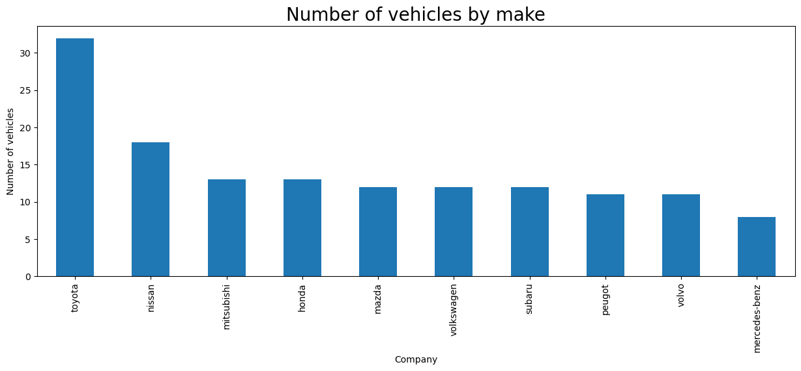
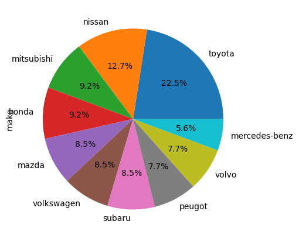
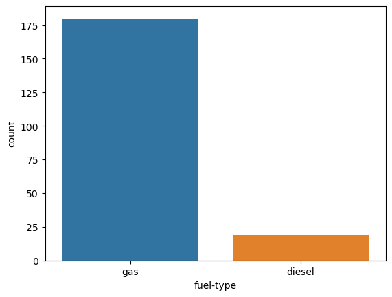
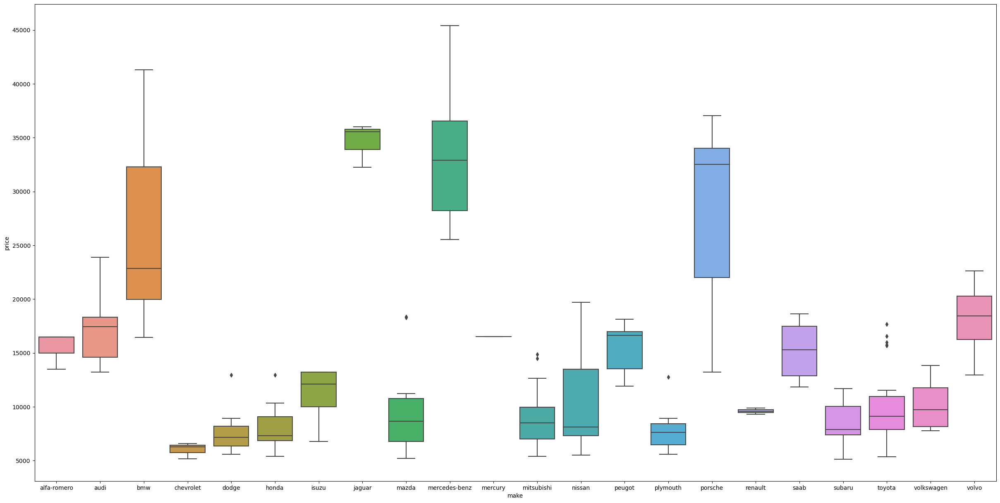
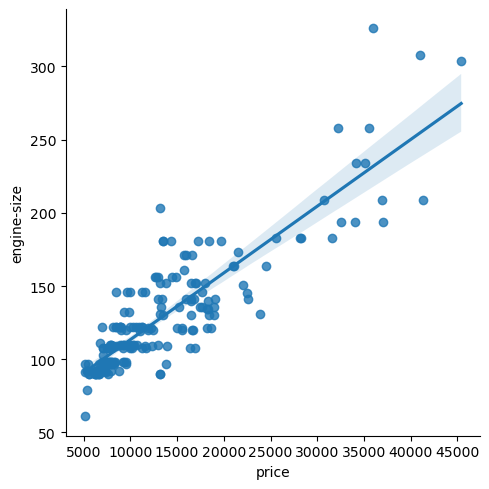
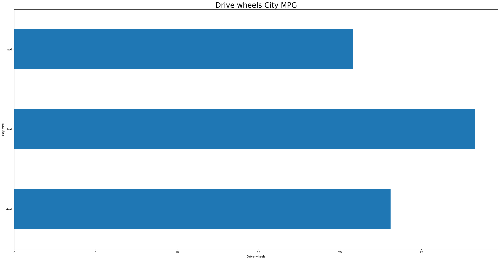
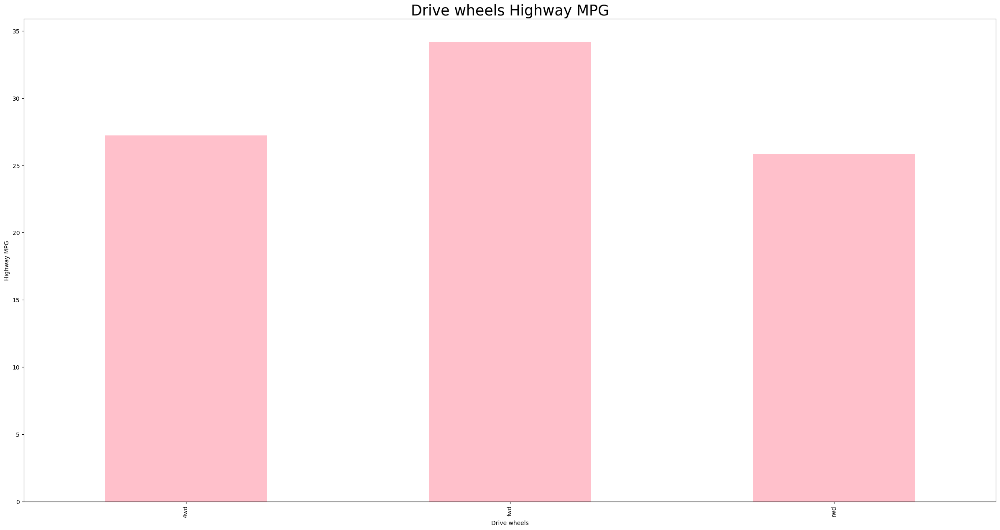
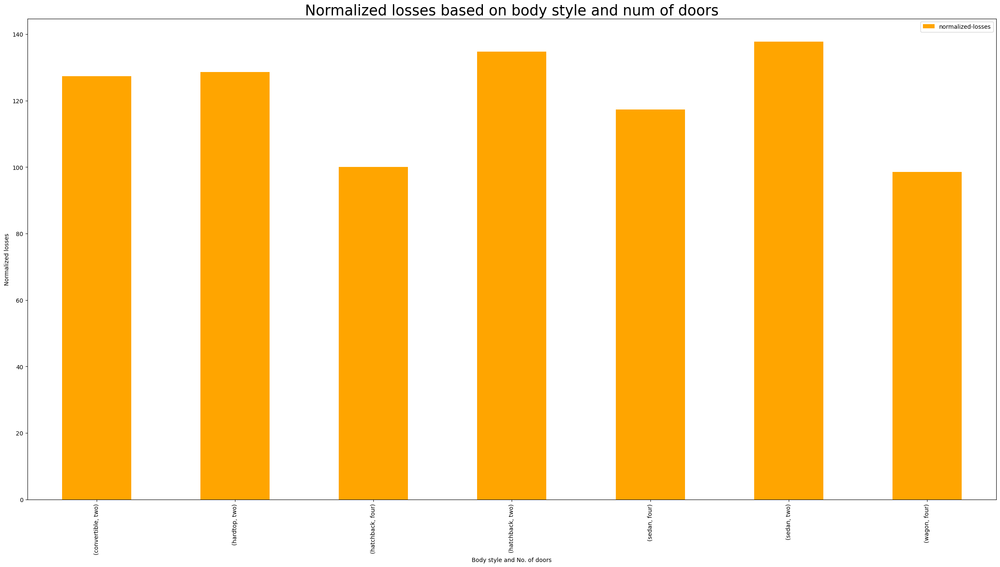

# Exploratory Data Analysis on Automobile Dataset

<b>This EDA is performed using the following tools and techniques :-</b>

<ul><li>Performed EDA on a Automobile Dataset.</li><li>Packages : Pandas and Numpy for Data Manipulation</li><li>Data Visualization Libraries : Matplotlib and Seaborn for Data Visualisation.</li><li>IDE : Jupyter Notebook</li></ul>
 
<b>Table of Contents :-</b>

<ul><li>Importing required libraries</li><li>Pre processing data in Python</li><li>Data Cleaning</li><li>Dealing Missing values</li><li>Data Formatting</li><li>Univariate Analysis</li><li>Bivariate Analysis</li></ul>

## Univariate Analysis :-

Univariate analysis is the simplest form of analyzing data. “Uni” means “one”, so in other words your data has only one variable. It doesn't deal with relationships and it's major purpose is to describe. It takes data, summarizes that data and finds patterns in the data.

Vehicle by make frequency diagram
By this we say that toyota make more vehicle

90% of the people use cars that run of gas rather than diesel

## Bivariate Analysis :-

Bivariate analysis is one of the simplest forms of quantitative (statistical) analysis. It involves the analysis of two variables (often denoted as X, Y), for the purpose of determining the empirical relationship between them.

<b>
Boxplot for make brand and price
</b>
Findings: Below are our findings on the make and price of the car :
    <ul><li> The most expensive car is manufacture by Mercedes benz and the less expensive is Chevrolet.</li>
    <li> The premium cars costing more than 20000 are BMW, Jaquar, Mercedes benz and Porsche.</li>
    <li> Less expensive cars costing less than 10000 are Chevrolet, Dodge, Honda, Mitsubishi, Plymoth.</li>
    <li> Rest of the cars are in the midrange between 10000 and 20000 which has the highest number of cars.</li></ul>

  

Positive Relationship between Price and Engine size (Engine size increase then price also increase)

Drive wheels and City MPG

Drive wheels and Highway MPG

<b>
Normalized losses based on body style and num of doors
</b>

Findings :
 As we understand the normalized loss which is the average loss payment per insured vehicle is calculated with many features of the cars which includes body style and no. of doors. Normalized losses are distributed across different body style but the two door cars has more number of losses than the four door cars.
 
 